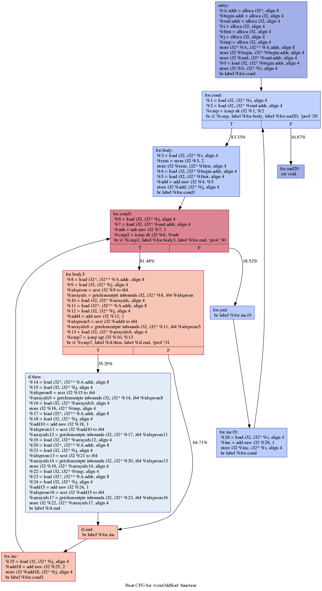
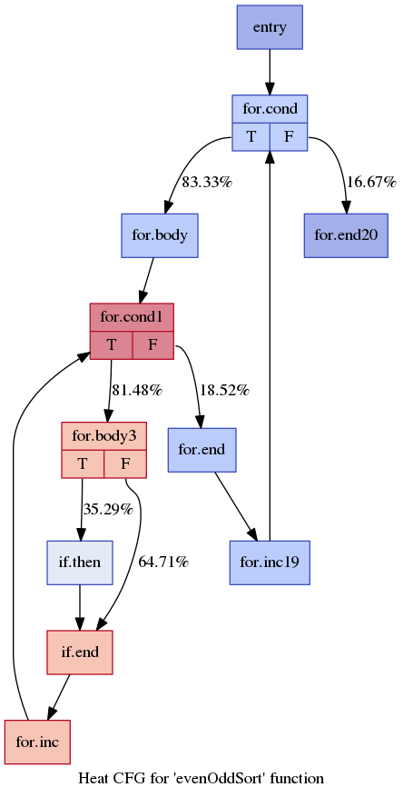
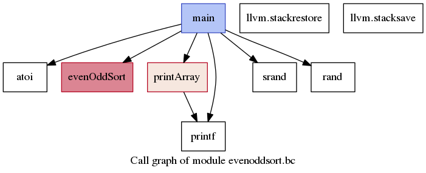

# LLVM CFG Printer Plugin

Given LLVM's strong recommendation to use the new pass manager, this repository aims to provide a LLVM plugin that is compatible with the new pass manager. It supports the latest version of LLVM infrastructure and offers capabilities such as DomTree visualization and visualization assistance for profiling.

It primarily implements analysis passes that generate visualization (dot) files that depict the (profiled) execution frequency of a piece of code using a cool/warm color map.

Cool/Warm color map:


LLVM Heat Printer supports profiling annotation.
In order to see how to use profiling information, look at Section [Using Profiling].
If no profiling is used, the basic block frequencies are estimated by means of heuristics.

## Build

Assuming that you already have LLVM libraries installed (this project using LLVM version 18.x.x and above).
Then clone this repo into your Transformation directory and build it just like other transformation libraries.

## Heat CFG Printer

The analysis pass '-dot-heat-cfg' generates the heat map of the CFG (control-flow graph) based on the basic block frequency.
Use '-dot-heat-cfg-only' for the simplified output without the LLVM code for each basic block.

<p align="center">


</p>

The user can also choose between an intra-function or inter-function maximum frequency reference.
For the intra-function heat map, activated with the flag '-heat-cfg-per-function', the heat scale will consider only the frequencies of the basic blocks inside the current function, i.e., every function will have a basic block with maximum heat.

For the inter-function heat map (default), the heat scale will consider all functions of the current module (translation unit), i.e., it first computes the maximum frequency for all basic blocks in the whole module, such that the heat of each basic block will be scaled in respect of that maximum frequency.

With the inter-function heat map, the CFGs for some functions can be completely cold.

In order to generate the heat CFG .dot file, use the following command:
```
$> opt -load-pass-plugin ../build/lib/libCFGPrinter.so -passes=dot-heat-cfg  <.bc file> >/dev/null
```

## Heat CallGraph Printer

The analysis pass '-dot-heat-callgraph' generates the heat map of the call-graph based on either the profiled number of calls or the maximum basic block frequency inside each function.
The following figure illustrates the heat call-graph highlighting the maximum basic block frequency inside each function.

<p align="center">

</p>

In order to generate the heat call-graph .dot file, use the following command:
```
$> opt -load-pass-plugin ../build/lib/libCFGPrinter.so -passes=-dot-heat-callgraph  <.bc file> >/dev/null
```

## Using Profiling

In order to use profiling information with the heat map visualizations, you first need to instrument your code for collecting the profiling information, and then annotate the original code with the collected profiling.

Instrumenting the code for profiling basic block frequencies:
```
$> clang -fprofile-generate ...
```
or, alternatively, you can use the older profiling implementation:
```
$> clang -fprofile-instr-generate ...
```

In both cases, execute the instrumented code with some representative inputs in order to generate profiling information.
After each execution a .profraw file will be created.
Use llvm-profdata to combine all .profraw files:
```
llvm-profdata merge -output=<file.profdata> <list of .profraw files>
```

In order to annotate the code, re-compile the original code with the profiling information:
```
$> clang -fprofile-use=<file.profdata> -emit-llvm -c ...
```
or, again, you can use the older profiling implementation:
```
$> clang -fprofile-instr-use=<file.profdata> -emit-llvm -c ...
```
This last command will generate LLVM bitcode files with the profiling annotations.

